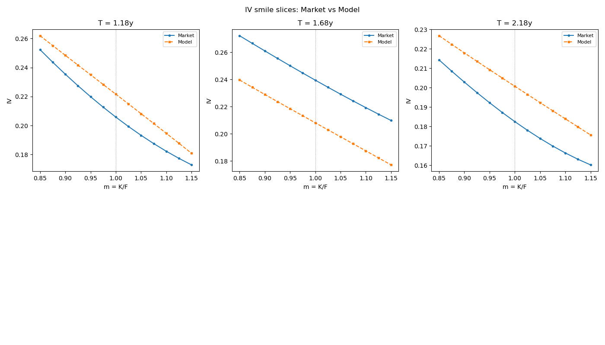
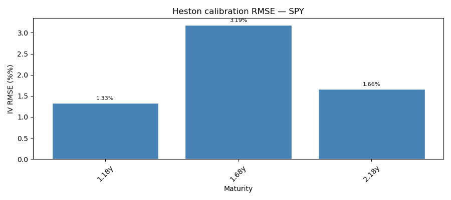

# Equity Options: Pricing & Volatility Calibration

Modular framework for pricing and calibrating equity options under stochastic volatility.  
Implements the full pipeline from raw market data to calibrated Heston parameters with fit diagnostics.

---

## Theoretical background

### Heston (1993) stochastic volatility model

Under the risk-neutral measure:

$$dS_t = (r - q) S_t \, dt + \sqrt{v_t} \, S_t \, dW_t^S$$
$$dv_t = \kappa(\theta - v_t) \, dt + \sigma \sqrt{v_t} \, dW_t^v, \quad d\langle W^S, W^v \rangle_t = \rho \, dt$$

The characteristic function of $\log S_T$ admits a closed form (Heston 1993), allowing semi-analytic pricing via Fourier inversion. The implementation uses the **little trap** formulation (Albrecher et al. 2007) which avoids the branch-cut discontinuity in the original paper.

**Implied volatility inversion**: model prices are inverted to IV via Black-76 + Brent's method, making the surface comparable across strikes and maturities.

**Feller condition**: $2\kappa\theta > \sigma^2$ ensures $v_t > 0$ a.s. Calibrated Heston parameters routinely violate this — it is logged as a warning, not an error.

### Dupire (1994) local volatility

Given an arbitrage-free call price surface $C(K, T)$:

$$\sigma_{\text{loc}}^2(K, T) = \frac{2 \left(\partial_T C + r K \, \partial_K C\right)}{K^2 \, \partial_{KK} C}$$

Implemented via bivariate spline interpolation of the IV surface followed by numerical differentiation.

---

## Calibration methodology

Two-stage calibration minimizing weighted IV MSE:

$$\min_{v_0, \kappa, \theta, \sigma, \rho} \sum_{i,j} w_{ij} \left(\sigma^{\text{model}}_{ij} - \sigma^{\text{mkt}}_{ij}\right)^2$$

where $w_{ij}$ weights ATM points higher (Gaussian in moneyness) and longer maturities higher ($\propto \sqrt{T}$).

1. **Differential evolution** — global search, finds the basin
2. **L-BFGS-B** — local refinement within the basin

---

## Results

### Synthetic calibration (parameter recovery)

Noiseless IV surface generated from known params, then recovered by calibration.  
True params: $v_0=0.04$, $\kappa=2.0$, $\theta=0.04$, $\sigma=0.3$, $\rho=-0.7$

| Param | True | Recovered | Abs Error |
|---|---|---|---|
| v0 | 0.0400 | 0.0400 | < 0.0001 |
| kappa | 2.0000 | 2.0000 | < 0.001 |
| theta | 0.0400 | 0.0400 | < 0.0001 |
| sigma | 0.3000 | 0.3000 | < 0.0001 |
| rho | -0.7000 | -0.7000 | < 0.0001 |

Overall IV RMSE < 0.01% on noiseless synthetic data.

### Market calibration — SPY (April 2026)

Spot: 686.10. Maturities: 1.2y, 1.7y, 2.2y. Full smile (OTM puts + OTM calls).

| Param | Value | Interpretation |
|---|---|---|
| v0 | 0.3926 | Current variance → 62.7% vol (elevated) |
| kappa | 10.34 | Fast mean-reversion |
| theta | 0.0339 | Long-run variance → 18.4% vol |
| sigma | 2.00 | Vol-of-vol (hit upper bound — see note) |
| rho | -0.98 | Strong negative skew (hit lower bound — see note) |

| Maturity | IV RMSE | |
|---|---|---|
| 1.18y | 1.33 bp | OK |
| 1.68y | 3.19 bp | OK |
| 2.18y | 1.66 bp | OK |
| **Overall** | **2.21 bp** | |

> **Note on boundary params**: `sigma` and `rho` hitting their bounds indicates Heston's 5-parameter family is not rich enough to match the current SPY skew. A known limitation — rough volatility models (e.g. rBergomi) handle steep skew better.

**IV smile slices — market vs model:**



**RMSE by maturity:**



---

## Methods

| Component | Description |
|---|---|
| `models/heston.py` | CF (little trap), Carr-Madan, Euler MC |
| `models/black_scholes.py` | Analytic BS pricing |
| `models/black76.py` | Forward-based BS (used for IV inversion) |
| `models/SABR.py` | Hagan (2002) implied vol approximation |
| `models/local_vol.py` | Dupire local vol from IV surface |
| `pricers/mc_engine.py` | GBM, antithetic variates, local vol MC |
| `greeks/bs_greeks.py` | Analytic BS Greeks (delta, gamma, vega, theta, rho) |
| `surfaces/market_iv_surface.py` | yfinance surface: OTM puts + calls, moneyness grid |
| `surfaces/model_iv_surface.py` | Heston IV surface via CF or MC |
| `surfaces/diagnostics.py` | IV errors, bucket analysis, RMSE by maturity |
| `utils/root_finding.py` | Bisection, Newton-Raphson, Brent |
| `utils/weights.py` | ATM-weighted, sqrt-T maturity weighting |

---

## Project structure

```text
equity-options-pricing-vol-calibration/
│
├── models/
│   ├── black_scholes.py        # BS analytic pricing
│   ├── black76.py              # Black-76 forward-based pricing
│   ├── heston.py               # CF (little trap), Carr-Madan, Euler MC
│   ├── local_vol.py            # Dupire local vol from IV surface
│   └── SABR.py                 # Hagan approximation + calibration
│
├── pricers/
│   ├── mc_engine.py            # GBM, antithetic, local vol simulators
│   ├── monte_carlo_pricer.py   # MC estimation with CI and control variates
│   └── control_variates.py
│
├── greeks/
│   ├── bs_greeks.py            # Analytic BS Greeks
│   └── Monte_Carlo_greeks.py   # FD, pathwise, and likelihood ratio Greeks
│
├── surfaces/
│   ├── market_iv_surface.py    # yfinance: OTM puts + calls, moneyness grid
│   ├── model_iv_surface.py     # Heston IV surface via CF or MC
│   └── diagnostics.py          # IV errors, bucket analysis, RMSE by maturity
│
├── utils/
│   ├── root_finding.py         # Bisection, Newton-Raphson, Brent
│   ├── weights.py              # ATM-weighted, sqrt-T maturity weighting
│   └── plots.py                # IV smile slices, RMSE bar chart
│
├── tests/
│   └── test_heston_calibration.py   # CF unit tests + calibration smoke test
│
├── results/
│   ├── iv_smile_slices.png          # Market vs model IV smiles (SPY)
│   └── heston_calibration_rmse.png  # RMSE by maturity (SPY)
│
└── experiments/
    ├── notebooks/              # Exploratory notebooks (Heston, SABR, local vol, MC)
    └── scripts/
        ├── heston_synthetic_calibration.py   # recover known params from noiseless surface
        └── heston_market_calibration.py      # ticker → calibrated Heston surface
```

---

## How to run

```bash
pip install numpy scipy torch yfinance pandas matplotlib

# Sanity check: recover known Heston params from synthetic surface
python experiments/scripts/heston_synthetic_calibration.py

# Calibrate to real market data
python experiments/scripts/heston_market_calibration.py --ticker SPY
python experiments/scripts/heston_market_calibration.py --ticker AAPL --max_expiries 30
```

---

## References

- Heston, S.L. (1993). *A closed-form solution for options with stochastic volatility.* Review of Financial Studies.
- Dupire, B. (1994). *Pricing with a smile.* Risk Magazine.
- Albrecher, H., Mayer, P., Schachermayer, W. & Teichmann, J. (2007). *The little trap.* Mathematical Finance.
- Hagan, P. et al. (2002). *Managing smile risk.* Wilmott Magazine.
- Longstaff, F.A. & Schwartz, E.S. (2001). *Valuing American options by simulation.* Review of Financial Studies.
